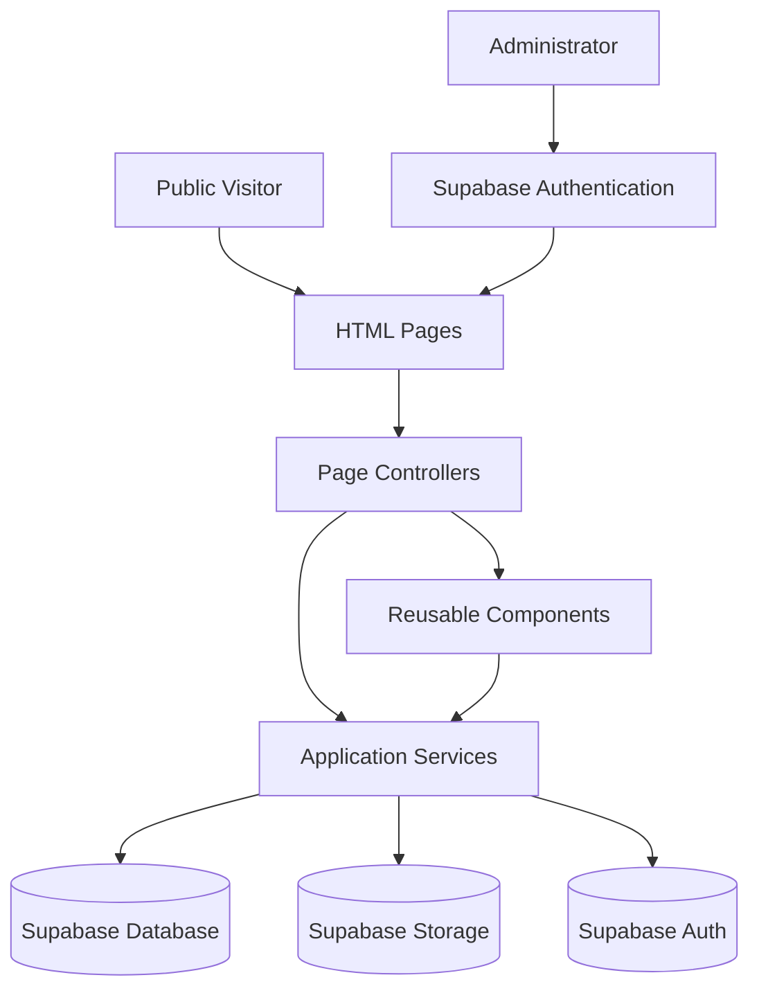
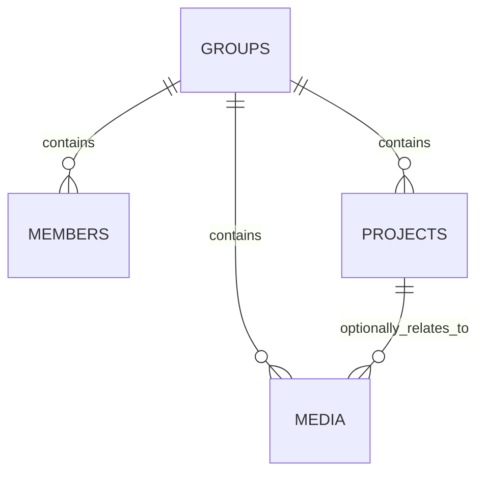
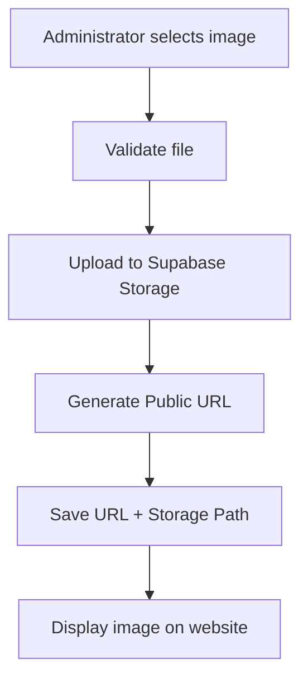

<!-- =========================================================
     ETU STUDENT SHOWCASE
     Faculty of Engineering - University of Peradeniya
     ========================================================= -->


<div align="center">

  

  <h1>English Teaching Unit Student Showcase</h1>

  <p>
    <strong>Faculty of Engineering · University of Peradeniya · Sri Lanka</strong>
  </p>

  <p>
    A dynamic student showcase platform for presenting student groups,
    projects, creative work, documentaries, presentations and gallery media
    produced through the English Teaching Unit.
  </p>

  <br>

  <!-- PROJECT STATUS BADGES -->

  

  

  

  

</div>


<br>


<!-- =========================================================
     QUICK NAVIGATION BUTTONS
     ========================================================= -->

<div align="center">

  <a href="index.html">
    
  </a>

  <a href="groups.html">
    
  </a>

  <a href="categories.html">
    
  </a>

  <a href="about.html">
    
  </a>

  <a href="admin-login.html">
    
  </a>

</div>


<br>


---

# 📌 About the Project

The **English Teaching Unit Student Showcase** is a web platform developed for the
English Teaching Unit of the **Faculty of Engineering, University of Peradeniya**.

The system allows visitors to explore student work while providing one authorized
administrator with a secure CMS for maintaining the content.

The platform includes:

- Student groups
- Student/member profiles
- Student projects
- Presentations
- Documentaries
- Group activities
- Art and exploratory work
- Photo galleries
- YouTube video integration
- Administrator content management
- Direct image uploads
- Draft / published content control


---

# 🖥️ Website Pages

## 🏠 Home Page

**File**

```text
index.html
```

**Purpose**

The main landing page of the student showcase.

### Includes

- English Teaching Unit introduction
- Faculty branding
- Dynamic showcase statistics
- Latest student projects
- Student group cards
- Mission
- Contact information
- Responsive shared footer with site navigation and administrator access

### Dynamic information

The following values are loaded automatically from Supabase:

```text
Student Groups
Published Projects
Students
Latest Projects
Group Information
```

No manual editing of these statistics is required.


---

## 👥 Groups Page

**File**

```text
groups.html
```

### Purpose

Provides a complete overview of student groups and projects.

### Visitors can

- Browse all published groups
- Browse projects
- Filter projects by category
- Open individual group pages

### Administrator can

- Create new student groups
- Upload group images
- Use external image URLs
- Set publication status
- Configure group display order


---

## 👤 Universal Group Page

**File**

```text
group.html
```

Groups are accessed using a query parameter.

### Examples

```text
group.html?group=ab01
group.html?group=ab02
group.html?group=ab03
group.html?group=ab04
```

The project does **not** require separate HTML files for every group.

For example, if a future group is created:

```text
AB05
```

the page automatically becomes:

```text
group.html?group=ab05
```

### Public view

Visitors can see:

- Group information
- Group cover image
- Student members
- Projects
- Gallery
- Videos
- Project information

### Administrator view

The authorized administrator additionally receives controls for:

```text
Edit Group
Delete Group

+ Add Student
Edit Student
Delete Student

+ Add Project
Edit Project
Delete Project

+ Add Media
Edit Media
Delete Media
```

This page is the main CMS management area.


---

## 🗂️ Categories Page

**File**

```text
categories.html
```

### Supported categories

| Icon | Category |
|---|---|
| 🎭 | Group Activities |
| 📊 | Presentations |
| 🎬 | Documentaries |
| 🎨 | Art & Explorer |

Category definitions are stored centrally in:

```text
assets/js/config/categories.js
```

### Dynamic statistics

For every category the system calculates:

```text
Project Count
Participating Group Count
Video Count
```

These values are derived from the current database instead of being hardcoded.

### Direct category links

Examples:

```text
categories.html?category=group-activities

categories.html?category=presentations

categories.html?category=documentaries

categories.html?category=art-explorer
```


---

## ℹ️ About Page

**File**

```text
about.html
```

Contains institutional information about the English Teaching Unit.

### Sections

- About the ETU
- Who We Are
- What We Do
- Our Community
- Teaching activities
- Creative projects
- Assessment and feedback
- Cross-disciplinary collaboration
- Student showcase call-to-action

This information is intentionally kept static because it represents
institutional website content rather than CMS-managed student data.


---

## 🔐 Administrator Login

**File**

```text
admin-login.html
```

Authentication is handled using **Supabase Auth**.

### Features

- Email/password authentication
- Show / hide password button
- Secure session handling
- Exact administrator authorization
- Automatic redirect after successful login

> Administrator credentials are never stored in HTML or JavaScript.


---

# ✨ Main Features

## Student Group Management

Administrator can:

```text
Create Group
Read Group
Update Group
Delete Group
```

Group information includes:

```text
Name
Slug
Tagline
Description
Cover Image
Card Image
Display Order
Published / Draft
```


---

## Student Management

Each group can contain multiple students.

Administrator can:

```text
Add Student
Edit Student
Delete Student
```

Student information includes:

```text
Registration Number
Name
Committee
Role
Display Order
Published / Draft
```

Incomplete registration numbers are displayed as entered rather than
being automatically changed.


---

## Project Management

Administrator can:

```text
Create Project
Edit Project
Delete Project
```

Project information includes:

```text
Title
Category
Description
Cover Image
YouTube URL
Duration
Display Order
Featured Status
Published Status
```


---

# 🖼️ Image Management

The CMS provides a reusable image-upload system.

Every supported image field can use either:

### Method 1 — Upload

```text
Drag & Drop
        OR
Choose File
```

The image is uploaded directly to:

```text
Supabase Storage
```

### Method 2 — External URL

Administrator can instead provide a direct publicly accessible image URL.

Example:

```text
https://example.com/image.jpg
```

External URLs do not use Supabase Storage space.


---

# 📁 Supported Image Types

Only the following formats are accepted:

```text
.jpg
.jpeg
.png
.webp
```

Supported MIME types:

```text
image/jpeg
image/png
image/webp
```


---

# 📦 Image Size Limit

Maximum size for one uploaded image:

```text
2 MB
```

The restriction is checked by:

```text
Browser validation
        +
Supabase Storage bucket configuration
```


---

# 📐 Recommended Image Dimensions

| Image Usage | Recommended Size |
|---|---:|
| Group Cover | `1600 × 700 px` |
| Group Card | `1200 × 750 px` |
| Project Cover | `1280 × 720 px` |
| Gallery Landscape | `1600 × 1200 px` |
| Gallery Portrait | `1200 × 1600 px` |

These are recommendations rather than strict dimension requirements.


---

# 🖼️ Gallery System

Each student group can maintain its own media gallery.

### Features

- Multiple image selection
- Multiple drag-and-drop
- Image previews before upload
- Automatic filename-based titles
- Category assignment
- Related-project assignment
- Published / draft control
- Individual image editing
- Individual image replacement
- Individual deletion


## Gallery Limit

Maximum:

```text
30 images per group
```

Example:

```text
23 / 30 images used
7 slots remaining
```

The limit is enforced by:

```text
Frontend uploader
        +
PostgreSQL database trigger
```

This prevents unnecessary Storage usage.


---

# ☁️ Supabase Storage

CMS-managed images are stored inside:

```text
etu-images
```

Suggested structure:

```text
etu-images/
│
└── groups/
    │
    ├── ab01/
    │   ├── cover/
    │   ├── card/
    │   ├── projects/
    │   └── gallery/
    │
    ├── ab02/
    │   ├── cover/
    │   ├── card/
    │   ├── projects/
    │   └── gallery/
    │
    ├── ab03/
    │
    └── ab04/
```


---

# 🛠️ Technology Stack

<div align="center">

  

  

  

  

  

  

  

</div>


### Frontend

```text
HTML5
Tailwind CSS
Vanilla JavaScript
JavaScript ES Modules
```

### Backend Services

```text
Supabase Database
Supabase Authentication
Supabase Storage
Supabase Row Level Security
PostgreSQL
```

No frontend JavaScript framework is required.


---

# 🧱 Application Architecture




---

# 🔄 Data Flow

The application follows:

```text
HTML Page
   ↓
Page Controller
   ↓
Reusable Component
   ↓
Service
   ↓
Supabase
```

Example:

```text
group.html
   ↓
groupPage.js
   ↓
projectCard.js
   ↓
dataService.js
   ↓
Supabase
```

Pages should not directly contain scattered database queries.


---

# 🗄️ Database Structure

The CMS uses four primary content tables:

```text
groups
members
projects
media
```


## Relationship Overview




### `groups`

Stores:

```text
Group identity
Slug
Description
Images
Display order
Publication state
```


### `members`

Stores:

```text
Student name
Registration number
Committee
Role
Display order
Publication state
```


### `projects`

Stores:

```text
Title
Category
Description
Image
YouTube link
Duration
Featured status
Publication state
```


### `media`

Stores:

```text
Gallery image
Title
Category
Related project
Display style
Display order
Publication state
```


---

# 🔗 Database Relationships

```text
groups
│
├── members
│
├── projects
│
└── media
```

When a group is removed:

```text
members   → deleted
projects  → deleted
media     → deleted
```

When an individual project is deleted:

```text
media.project_id → NULL
```

The gallery image remains available as general group media.


---

# 🔐 Authentication & Authorization

Authentication and authorization are separate.

## Authentication

Handled by:

```text
Supabase Auth
```

It verifies:

```text
Email
Password
Session
```


## Authorization

Handled by:

```text
Supabase Row Level Security
```

RLS decides whether the signed-in user may:

```text
INSERT
UPDATE
DELETE
```

CMS buttons being hidden is only a user-interface feature.

The real security boundary is the database policy.


---

# 👁️ Public vs Administrator Access

## Public Visitor

Can:

```text
View published groups
View published students
View published projects
View published gallery media
Browse categories
Watch project videos
```

Cannot:

```text
Create
Update
Delete
See draft content
```


## Administrator

Can:

```text
Create content
Edit content
Delete content
Upload images
Replace images
Manage drafts
Publish content
Manage gallery media
```


---

# 📝 Draft & Published Content

CMS records support:

```text
is_published
```

### Published

Visible publicly.

### Draft

Visible to the administrator but hidden from public visitors.

This allows content to be prepared before release.


---

# 📂 Project Structure

```text
uop/
│
├── index.html
├── groups.html
├── group.html
├── categories.html
├── about.html
├── admin-login.html
├── README.md
│
└── assets/
    │
    ├── css/
    │   └── app.css
    │
    ├── images/
    │   ├── uoplogo.png
    │   ├── uope25.jpg
    │   ├── uopefac.jpg
    │   └── ...
    │
    └── js/
        │
        ├── config/
        │   ├── tailwind.js
        │   ├── categories.js
        │   └── images.js
        │
        ├── services/
        │   ├── supabase.js
        │   ├── authService.js
        │   ├── dataService.js
        │   ├── storageService.js
        │   └── imageChoiceService.js
        │
        ├── components/
        │   ├── navbar.js
        │   ├── footer.js
        │   ├── adminBanner.js
        │   ├── groupCard.js
        │   ├── projectCard.js
        │   ├── memberRow.js
        │   ├── mediaCard.js
        │   ├── imagePicker.js
        │   ├── emptyState.js
        │   ├── modal.js
        │   └── toast.js
        │
        ├── pages/
        │   ├── homePage.js
        │   ├── groupsPage.js
        │   ├── groupPage.js
        │   ├── categoriesPage.js
        │   ├── aboutPage.js
        │   └── adminLoginPage.js
        │
        └── utils/
            ├── dom.js
            ├── format.js
            └── validation.js
```


---

# 🧩 JavaScript Structure

## `config/`

Stores fixed application configuration.

```text
tailwind.js
categories.js
images.js
```


## `services/`

Handles communication with Supabase.

```text
supabase.js
authService.js
dataService.js
storageService.js
imageChoiceService.js
```


## `components/`

Reusable interface elements.

Examples:

```text
Navbar
Footer
Group Card
Project Card
Member Row
Media Card
Image Picker
Modal
Toast
```


## `pages/`

Each major HTML page has one controller.

```text
index.html
    ↓
homePage.js


groups.html
    ↓
groupsPage.js


group.html
    ↓
groupPage.js


categories.html
    ↓
categoriesPage.js


about.html
    ↓
aboutPage.js


admin-login.html
    ↓
adminLoginPage.js
```


## `utils/`

Reusable helper functions.

```text
DOM utilities
Formatting
Validation
```


---

# ▶️ Running the Project Locally

Because this project uses JavaScript ES Modules, it should run through
an HTTP server.

Do **not** open pages using:

```text
file://
```


## Python Local Server

Open a terminal in the project root:

```bash
python -m http.server 5500
```

Then visit:

```text
http://localhost:5500/
```


### Main pages

```text
http://localhost:5500/index.html

http://localhost:5500/groups.html

http://localhost:5500/categories.html

http://localhost:5500/about.html

http://localhost:5500/admin-login.html
```


---

# 🔐 Administrator Workflow

## 1. Login

Open:

```text
admin-login.html
```

Enter the administrator credentials.

After authentication the administrator is redirected to the website.


## 2. Administrator Mode

When authenticated, the portal displays:

```text
Administrator Mode
```

The CMS controls then become available.


## 3. Manage Groups

Open:

```text
groups.html
```

Use:

```text
+ Add Student Group
```


## 4. Manage Group Content

Open:

```text
group.html?group=GROUP_SLUG
```

Example:

```text
group.html?group=ab01
```


## 5. Manage Students

```text
+ Add Student
Edit
Delete
```


## 6. Manage Projects

```text
+ Add Project
Edit
Delete
```


## 7. Manage Gallery

```text
+ Add Media
```

Supports multiple drag-and-drop image uploads.


---

# 🖼️ Upload Workflow




---

# ♻️ Safe Image Replacement

When replacing an uploaded image:

```text
Upload new image
        ↓
Update database
        ↓
Confirm database success
        ↓
Delete old Storage image
```

If the database operation fails:

```text
new uploaded file
        ↓
automatically removed
```

This reduces orphaned files inside Supabase Storage.


---

# 🛡️ Security Notes

### Never store in frontend code

```text
Administrator password
Supabase service-role secret
Private database credentials
```

### Safe frontend configuration

The Supabase public/publishable key is designed for client applications.

Security is enforced through:

```text
Row Level Security
```

and not through hiding the public key.


---

# 🧪 Recommended Testing Checklist

## Visitor Mode

- [ ] Homepage loads
- [ ] Groups load
- [ ] Group pages load
- [ ] Categories work
- [ ] Projects load
- [ ] Gallery loads
- [ ] Draft content is hidden
- [ ] Admin controls are hidden


## Administrator Mode

- [ ] Login works
- [ ] Logout works
- [ ] Create group works
- [ ] Edit group works
- [ ] Delete group works
- [ ] Add student works
- [ ] Edit student works
- [ ] Delete student works
- [ ] Add project works
- [ ] Edit project works
- [ ] Delete project works
- [ ] Single-image upload works
- [ ] Image URL works
- [ ] Multi-image gallery upload works
- [ ] Gallery edit works
- [ ] Gallery delete works
- [ ] 2 MB restriction works
- [ ] Invalid file types are rejected
- [ ] 30-image gallery limit works
- [ ] Draft content is visible only to administrator


---

# 📸 Screenshots

Screenshots can be added to:

```text
assets/images/screenshots/
```

Suggested files:

```text
home.png
groups.png
group-page.png
categories.png
admin-login.png
admin-edit.png
gallery-upload.png
```


Then this section can display them:

```html
<p align="center">
    
</p>
```

> Add this only after the screenshots are available in the repository.


---

# 🌍 Deployment

The frontend can be hosted using a static-site hosting provider because
database, authentication and Storage are handled by Supabase.

Before production deployment check:

```text
Relative asset paths
Supabase RLS policies
Storage policies
Published/draft visibility
Browser console errors
Responsive layouts
Administrator authentication
```


---

# ➕ Adding Future Groups

Do **not** create another group HTML page.

For example:

```text
AB05
```

should be created from the CMS.

The public URL automatically becomes:

```text
group.html?group=ab05
```

This universal routing architecture should be preserved.


---

# 🎯 Content Ownership

## Managed through Supabase CMS

```text
Groups
Students
Projects
Gallery Media
Group Images
Project Images
```


## Stored as static website content

```text
University identity
ETU introduction
About information
Mission
Contact information
Navigation structure
Official category definitions
```


---

# 👨‍💻 Development Guidelines

When extending the project:

### Do

```text
Use reusable components
Use services for database access
Use ES Modules
Use addEventListener()
Validate user input
Use RLS for authorization
Use Supabase Storage for CMS images
```


### Avoid

```text
Hardcoded student/project data
Duplicate group HTML pages
CMS localStorage
Inline onclick handlers
Scattered Supabase queries
Administrator passwords in code
Service-role keys in frontend code
```


---

# 🏛️ Institution

<div align="center">

  

  <br><br>

  <strong>English Teaching Unit</strong>

  <br>

  Faculty of Engineering

  <br>

  University of Peradeniya

  <br>

  Sri Lanka

</div>


<br>


---

<div align="center">

### Built as a student showcase platform for the English Teaching Unit

**Faculty of Engineering · University of Peradeniya**

<br>

<a href="index.html">
  
</a>

<a href="groups.html">
  
</a>

</div>